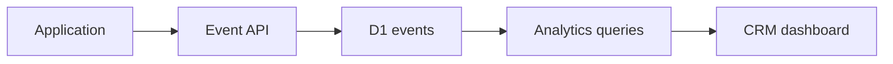

# Analytics base

Aplicaciones envían `POST /v1/events` o `/v1/events/batch` con `Authorization: Bearer`. La API resuelve application, project y organization desde la credencial; nunca confía en esos IDs del body. El secret se hashea y no se persiste en claro. La key seed `cor_app_dev_cosquin_2026` es exclusivamente local.

Los eventos admiten `anonymous_user_id`, `session_id`, `occurred_at` y JSON `properties`. Analytics consulta D1 con filtros de organización y rangos `24h`, `7d`, `30d` o `all`. Las métricas base son usuarios únicos, sesiones, opens, juegos iniciados/terminados, premios ganados/reclamados, tasas y actividad reciente. `prize_won` es señal analítica, no prueba suficiente para entregar premios reales.

Endpoints: `/analytics/summary` y `/analytics/activity`; ambos requieren sesión, membership y organización activa. Antes de producción faltan rate limiting distribuido, rotación/revocación operativa y evaluación de Analytics Engine para volumen alto.
