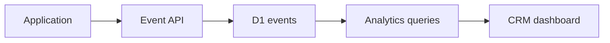

# Analytics base

Aplicaciones envían `POST /v1/events` o `/v1/events/batch` con `Authorization: Bearer`. La API resuelve application, project y organization desde la credencial; nunca confía en esos IDs del body. El secret se hashea y no se persiste en claro. La key seed `cor_app_dev_cosquin_2026` es exclusivamente local.

Los eventos admiten `anonymous_user_id`, `session_id`, `occurred_at` y JSON `properties`. Analytics consulta D1 con filtros de organización y rangos `24h`, `7d`, `30d` o `all`. Las métricas base son usuarios únicos, sesiones, opens, juegos iniciados/terminados, premios ganados/reclamados, tasas y actividad reciente. `prize_won` es señal analítica, no prueba suficiente para entregar premios reales.

## Analytics por tipo de aplicación

Las aplicaciones tienen `application_type` como texto: `generic`, `webar`, `game`, `website` o `configurator`. Cosquín está configurada como `webar`. El resumen agrega usuarios únicos, sesiones, aperturas, eventos totales, eventos por usuario y última actividad, manteniendo las métricas de juegos existentes.

`/analytics/breakdown?dimension=event` devuelve los eventos principales ordenados por cantidad y respeta rango y filtros de proyecto/aplicación. La UI usa KPIs WebAR para aplicaciones `webar`, KPIs de juegos para `game` y el conjunto genérico como fallback.

En desarrollo, `/dev/events` requiere sesión CRM y organización activa y permite inspeccionar hasta 100 eventos crudos con `projectId`, `applicationId` y `limit`. En producción responde 404.

Endpoints: `/analytics/summary`, `/analytics/activity`, `/analytics/breakdown` y `/dev/events`; requieren sesión, membership y organización activa.

## Catálogo de eventos

`POST /v1/events` valida `event` contra `KNOWN_EVENT_NAMES` en `packages/types/src/index.ts`. Además de los eventos de las aplicaciones existentes, el catálogo reconoce estos eventos de Treasure Hunt:

| Evento | Semántica |
| --- | --- |
| `hunt_started` | Nueva Hunt Session creada. |
| `hunt_resumed` | Sesión existente recuperada. |
| `step_blocked` | Intento válido de trigger correspondiente a un Step aún bloqueado. |
| `step_completed` | El servidor confirmó un Step completado. |
| `hunt_completed` | El servidor confirmó la Hunt completada. |
| `reward_issued` | El servidor emitió un Reward Grant. |
| `reward_redeemed` | Se confirmó un Redemption válido. |
| `hunt_reset` | El progreso se reinició mediante una capacidad autorizada. |

Estos nombres usan `snake_case`, igual que el resto del catálogo. `reward_issued` es deliberado: no existe `reward_generated` en el catálogo actual y no se agrega como alias. `reward_issued` representa la emisión del Grant por el servidor; no describe una mera preparación o cálculo de recompensa.

El envelope no cambia: continúan siendo válidos `event`, `userId`, `sessionId`, `occurredAt` en milisegundos epoch y `properties`, con `Authorization: Bearer` y tenant/proyecto/aplicación derivados de la application credential. El API no define schema por evento para `properties`: acepta JSON arbitrario dentro del límite total de 32 KiB y conserva sus valores sin exigir `redemptionToken`. No existe un campo `eventId` ni una idempotency key nativa; el id generado en la respuesta es del servidor. Los clientes pueden mantener un identificador determinista dentro de `properties` para correlación, pero el API no aplica deduplicación por él.
