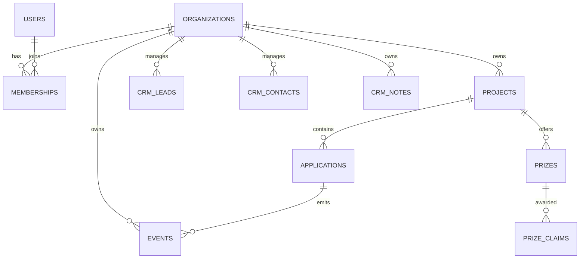

# Corsteno CRM — modelo de datos

El modelo usa UUID como IDs públicos y epoch milliseconds para timestamps. Las entidades tenant-specific llevan `organization_id`; toda consulta futura debe incluirlo en sus predicados. No hay autenticación, passwords, API keys ni CRUD en esta etapa.

Tablas: `organizations`, `users`, `memberships`, `projects`, `applications`, `events`, `app_sessions`, `prizes`, `prize_claims`, `crm_leads`, `crm_contacts` y `crm_notes`.

`events.properties` es JSON en SQLite, `app_sessions` representa sesiones de uso anónimas —no sesiones de login— y se incluye porque facilita agregaciones futuras. `crm_notes` es polimórfica mediante `entity_type`/`entity_id`, una decisión intencional para mantenerla simple; el servicio deberá validar que la entidad referida pertenece a la misma organización.

Los eventos y claims son históricos y no usan soft delete. Las entidades operativas usan `status` y las foreign keys son conservadoras: no se define cascade global para evitar borrar históricos accidentalmente. Analytics Engine podrá recibir eventos masivos en una etapa futura, mientras D1 conserva los datos operativos necesarios.
